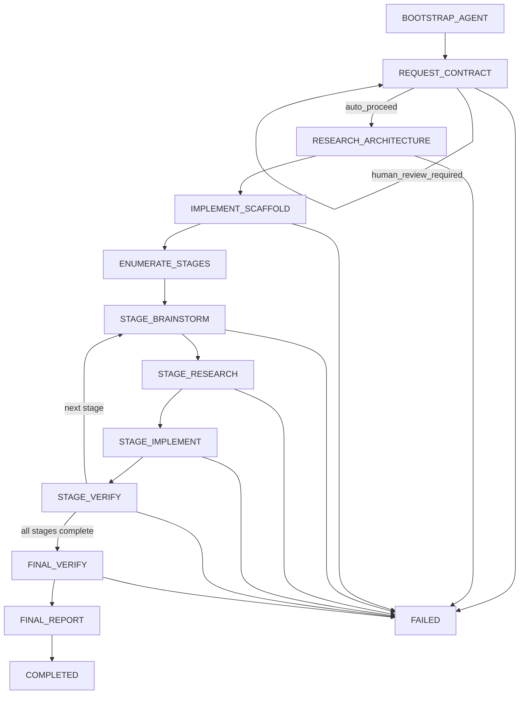

# MVP Builder for Codex + Claude Code

[](LICENSE)

`mvp-builder` is a disk-backed MVP workflow that helps coding agents push a vague product request toward a believable first version with less human steering.

Instead of treating each request like a one-off implementation task, it moves through an explicit state machine with request contract, architecture research, scaffold, stage planning, stage research, implementation, verification, and final handoff. The workflow stays resumable because each run writes durable artifacts to disk.

This repository now supports two host environments:

- `Codex` via the root [SKILL.md](SKILL.md)
- `Claude Code` via the installable adapter under [adapters/claude-code](adapters/claude-code)

## What It Does

`mvp-builder` helps a host agent:

- turn a product idea into a structured build workflow
- lock an approved request contract before building
- research architecture and stage-level decisions when useful
- scaffold the project
- break work into clear implementation stages
- implement and verify each stage
- produce a final report with what was built, what remains, and what to test next

## Repo Layout

- [SKILL.md](SKILL.md): Codex adapter entrypoint
- [core/scripts/mvp_builder.py](core/scripts/mvp_builder.py): shared workflow runner
- [core/prompts](core/prompts): shared prompt templates
- [adapters/claude-code](adapters/claude-code): Claude Code adapter templates and installer
- [agents/openai.yaml](agents/openai.yaml): Codex skill metadata

## State Machine



Core states:

- `BOOTSTRAP_AGENT`
- `REQUEST_CONTRACT`
- `RESEARCH_ARCHITECTURE`
- `IMPLEMENT_SCAFFOLD`
- `ENUMERATE_STAGES`
- `STAGE_BRAINSTORM`
- `STAGE_RESEARCH`
- `STAGE_IMPLEMENT`
- `STAGE_VERIFY`
- `FINAL_VERIFY`
- `FINAL_REPORT`

Each run writes durable files like:

- `run_spec.json`
- `state.json`
- `agent_session.json`
- `events.jsonl`
- `status.md`
- `latest_update.md`
- `human_progress.md`
- artifacts under `artifacts/`

## Research

This version is intentionally self-contained.

It does not depend on:

- OpenClaw services
- brokered research queues
- external researcher agents

When research is needed, the active host should use its native web research capability and write the useful conclusions into the run artifacts.

## Install For Codex

Clone the repo into your Codex skills directory under the skill name `mvp-builder`:

```bash
git clone https://github.com/Pourias/mvp-builder-codex-claude-code.git ~/.codex/skills/mvp-builder
```

Then open a fresh Codex thread and say something like:

```text
Use $mvp-builder to build a tiny local CRM for one salesperson.
```

## Install For Claude Code

Clone the repo anywhere you want to keep shared tools:

```bash
git clone https://github.com/Pourias/mvp-builder-codex-claude-code.git ~/tools/mvp-builder
```

Then install the Claude Code adapter into the project you want to build:

```bash
python3 ~/tools/mvp-builder/core/scripts/install_claude_code_adapter.py \
  --project /absolute/path/to/your/project
```

That installer will:

- add or update an `MVP Builder` block inside the target project's `CLAUDE.md`
- install `.claude/commands/mvp-builder.md` for the target project

After that, open Claude Code in the target project and run:

```text
/mvp-builder Build a tiny local CRM for one salesperson.
```

## Manual Runner Usage

Initialize a run:

```bash
python3 core/scripts/mvp_builder.py init \
  --host codex \
  --raw-input "Build a tiny local CRM for one salesperson"
```

Render the current prompt:

```bash
python3 core/scripts/mvp_builder.py render-prompt --run <run-dir>
```

Apply the reply for that state:

```bash
python3 core/scripts/mvp_builder.py apply-reply \
  --run <run-dir> \
  --reply-file /absolute/path/to/reply.md
```

Check status:

```bash
python3 core/scripts/mvp_builder.py status --run <run-dir>
```

## Validation

The runner itself uses only the Python standard library.

Minimal local validation:

```bash
python3 -m py_compile core/scripts/mvp_builder.py
```

If you want to use the bundled Codex skill validator, install `PyYAML` first:

```bash
python3 -m pip install PyYAML
python3 ~/.codex/skills/.system/skill-creator/scripts/quick_validate.py ~/.codex/skills/mvp-builder
```

## Community

- Contribution guide: [CONTRIBUTING.md](CONTRIBUTING.md)
- Code of conduct: [CODE_OF_CONDUCT.md](CODE_OF_CONDUCT.md)
- Support: [SUPPORT.md](SUPPORT.md)
- Security reporting: [SECURITY.md](SECURITY.md)

## License

This project is released under the MIT License. See [LICENSE](LICENSE).

## Best First Test

The best way to test `mvp-builder` is with a small real MVP request, for example:

- a tiny CRM notes app
- a local habit tracker
- a one-page invoice tracker
- a simple shared expense tracker

Start small. The point of the first test is to see whether the workflow stays focused, uses research when needed, and gets to a believable MVP handoff with minimal intervention.

## Maintainer

Maintained by [@Pourias](https://github.com/Pourias).
